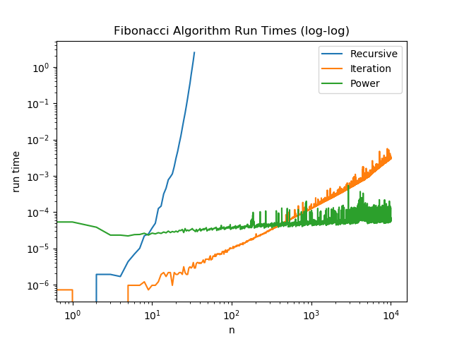

# Answers

Put any answers to questions in the assignment in this file, or any commentary you don't include in the code.

This is a markdown file (the `.md` extension gives it away). If you have never used markdown before, check out [this short guide](https://guides.github.com/features/mastering-markdown/).

## Problem 0
You don't need to say anything here.  Just complete [`fizzbuzz.py`](fizzbuzz.py).

## Problem 1
The answer is: floor(log2(n)) + (#(n)-1)
Short explanation: Recursion happens floor(log2(n)) times and in each recursion at least one addition happens. In addition, whenever an
odd number is divided by 2 a remainder is added and the total number this happens is represented in #(n)-1 term.
Long explanation:
The recursion happens floor(log2(n)) times, because each recursion is added whenever the n is divided by 2 possibly with remainder.
For instance when n=13, since 13 can be divided by 2 three times with/without remainders, floor(log2(13))=3 times of recursion occur.
In each recursion we have at least one addition, ie. (a+a), and possibly another whenever there is a remainder, ie. a. The number of times we
have remainder is the total number of non-zero bits (n's binary representation) minus 1.  

## Problem 2

Answer: fibonacci_iter is asymptotically faster than fibonacci_recursive.

The number of additions involved in fibonacci_recursive grows in its own Fibonacci sequence. For instance, computing F_4 involves 3 additions, F_5 involves 5 additions and F_6 8 additions. This growth is super-linear. By contrast additions involved in fibonacci_iter algorithm grows only linearly. For instance F_4 involves 3, F_5 involves 4 and F_6 involves only 5. Although this may not be a completely accurate picture, the idea is that fibonacci_recursive algorithm does a lot of redundant additions as n grows, while fibonacci_iter does not.

## Problem 3

## Problem 4

